# Stanislav Vasenkov

**QA Automation · AI · Engineering**

Building test automation, developer tools and AI-powered engineering workflows.

[Telegram](https://t.me/qa_automation) · [LinkedIn](https://www.linkedin.com/in/stanislav-vasenkov) · [QA.GURU](https://qa.guru)

---

## 🤖 AI Engineering

I use AI as an engineering tool — not just as a chatbot.

`Claude` · `Cursor` · `Cline` · `Ollama` · `MCP` · `RAG` · `Agents` · `LLM Evaluation` · `LLM-as-Judge` · `Local LLMs`

- AI-assisted software development
- Local LLMs and model orchestration
- AI agents and MCP
- LLM evaluation
- AI-powered test automation
- Developer tooling

---

## 🚀 What I'm building

**[greedy-token](https://github.com/svasenkov/greedy-token)**  
AI-assisted development workflow and LLM engineering experiments.

**[QA.GURU](https://qa.guru)**  
QA automation education and engineering community.  
[@qa_guru](https://t.me/qa_guru) · [@qa_guru_chat](https://t.me/qa_guru_chat) · [github.com/qa-guru](https://github.com/qa-guru)

`Java` · `Selenide` · `REST Assured` · `Appium` · `Playwright` · `CI/CD` · `AI`

**[autotests.ai](https://autotests.ai)**  
Test automation AI-service for QA.GURU students.

---

## 🧪 Engineering

**Automation**  
`Java` · `Selenide` · `Selenium` · `Playwright` · `Appium` · `REST Assured`

**Backend & tooling**  
`Java` · `Go` · `Python` · `TypeScript` · `Rust` · `Gradle` · `Spring`

**Infrastructure**  
`Docker` · `Jenkins` · `GitHub Actions` · `Allure` · `Selenoid`

**AI**  
`Claude` · `Cursor` · `Cline` · `Ollama` · `MCP` · `RAG` · `Agents`

---

## 📊 GitHub

  
  

  

---

## 🔥 Open Source

- [Allure Notifications](https://github.com/qa-guru/allure-notifications) — Allure reports to Telegram / Slack / email
- [Selenoid](https://github.com/qa-guru/selenoid) — browser automation infrastructure
- [Selenoid UI](https://github.com/qa-guru/selenoid-ui) — UI for Selenoid
- [greedy-token](https://github.com/svasenkov/greedy-token) — AI-assisted development workflow and LLM engineering experiments

---

## 📫 Find me

- Telegram: [@qa_automation](https://t.me/qa_automation) — QA Automation community · [@qa_guru](https://t.me/qa_guru) · [@qa_guru_chat](https://t.me/qa_guru_chat)
- LinkedIn: [stanislav-vasenkov](https://www.linkedin.com/in/stanislav-vasenkov)
- QA.GURU: [qa.guru](https://qa.guru) · [github.com/qa-guru](https://github.com/qa-guru)
- autotests.ai: [autotests.ai](https://autotests.ai)

---

Build less manually. Automate more. 🤖

